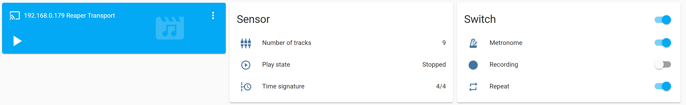

# REAPER DAW

[![GitHub Release][releases-shield]][releases]
[![GitHub All Releases][downloads-total-shield]][releases]
[![hacs_badge][hacs-shield]][hacs]
[![Buy me a coffee][buy-me-a-coffee-shield]][buy-me-a-coffee]
[![PayPal_Me][paypal-me-shield]][paypal-me]

[REAPER](https://www.reaper.fm/) is a complete digital audio production application for computers, offering a full multitrack audio and MIDI recording, editing, processing, mixing and mastering toolset.REAPER supports a vast range of hardware, digital formats and plugins, and can be comprehensively extended, scripted and modified.

# Features

- monitoring current play state of REAPER instance
- `media_player` for transport actions (rewind, stop, play, pause, fast-forward) and volume
- enabling/disabling metronome
- enabling/disabling repeat
- starting and stopping recording
- a service for running REAPER actions, start recording, undo and redo

## Sensors

- `switch.metronome`
- `switch.repeat`
- `switch.record`
- `media_player.reaper`
- `sensor.number_of_tracks`
- `sensor.time_signature`
- `sensor.play_state`

# Manual installation

Place `custom_components/reaper` directory inside custom_components dir and restart Home Assistant

# HACS installation

This component is available on [HACS](https://hacs.xyz) default.

# Configuration

## Setup REAPER web interface

1. Launch your REAPER DAW
1. Hit `Ctrl + P` or go to Options > Preferences
1. Navigate to "Control/OSC/web" menu and click "Add"
1. From the "Control surface mode" dropdown menu choose "Web browser interface"
1. Set the web interface port or leave default `8080`
1. Optionally set username:password
1. Optionally set the default web interface
1. Copy the Access URL and paste it in your browser - now your REAPER has a web interface.
1. Hit OK in both preference windows

## Setup Integration

Before starting the setup please ensure that your REAPER instance is running and its web interface is accessible from the web browser.

To configure integration in Home Assistant, go to **Configuration** >> **Integrations** >> **Add integration** >> **REAPER DAW** or use My Home Assistant link:

After adding integration, you can configure hostname, port and optionally username and password of REAPER's web interface.

Configuration also allows you to specify an update interval in seconds, during which status data from REAPER will be fetched.

[releases]: https://github.com/kubawolanin/ha-reaper/releases
[releases-shield]: https://img.shields.io/github/release/kubawolanin/ha-reaper.svg?style=popout
[downloads-total-shield]: https://img.shields.io/github/downloads/kubawolanin/ha-reaper/total
[buy-me-a-coffee-shield]: https://img.shields.io/static/v1.svg?label=%20&message=Buy%20me%20a%20coffee&color=6f4e37&logo=buy%20me%20a%20coffee&logoColor=white
[hacs-shield]: https://img.shields.io/badge/HACS-Default-orange.svg
[hacs]: https://hacs.xyz/docs/default_repositories
[buy-me-a-coffee]: https://www.buymeacoffee.com/kubawolanin
[paypal-me-shield]: https://img.shields.io/static/v1.svg?label=%20&message=PayPal.Me&logo=paypal
[paypal-me]: https://www.paypal.me/kubawolanin
